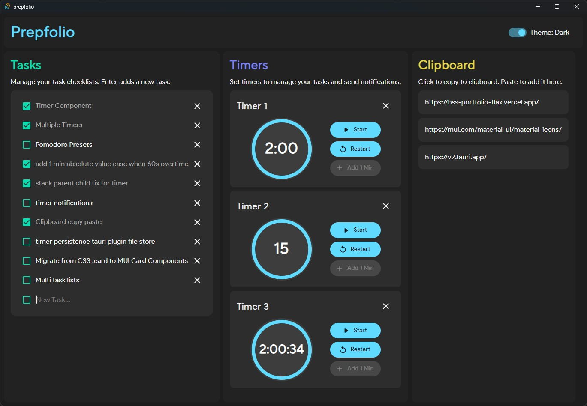

# Prepfolio
A productivity desktop app with several quick and useful utilities used by me daily.

### Tech
- Tauri
- TypeScript
- React
- Custom CSS styling
- MaterialUI Components

### Features
- [x] Manage tasks and auto save to local .json file
- [x] Set timers and get desktop notifications
- [x] Persistent clipboard for frequent pastes
- [ ] Multiple task lists with descriptions, due dates and reminders   
- [ ] Timers persistence with Tauri Plugin Store
- [ ] Pomodoro presets
- [ ] Quick reference dictionary
- [ ] Searchable system clipboard history integration
- [ ] GitHub-like habit/daily progress trackers. Mood trackers
- [ ] Calendar view
- [ ] Daily Activity Tracker

### Screenshots

